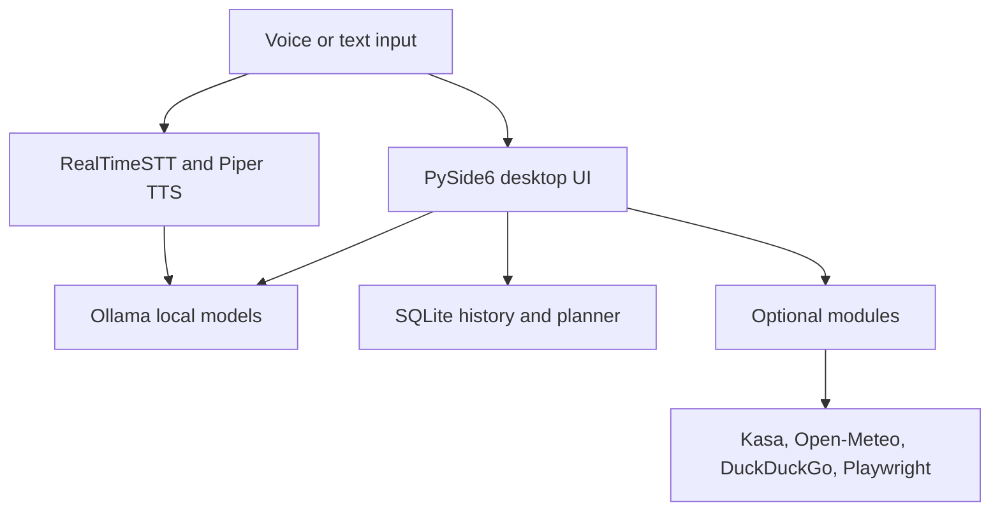

# JARVIS Local AI

<p align="center">
  <strong>A privacy-focused desktop AI assistant for Windows.</strong><br>
  Local chat, voice interaction, planning, smart-home control, live briefings,
  and browser automation in one Python application.
</p>

<p align="center">
  <a href="https://github.com/bertrandrusa/jarvis-local-ai/actions/workflows/ci.yml">
    
  </a>
  
  
  
</p>

<p align="center">
  <a href="https://jarvis-cloud-demo.rusanganbertrand.chatgpt.site"><strong>Launch the cloud demo</strong></a>
  ·
  <a href="https://github.com/bertrandrusa/jarvis-local-ai">Explore the source</a>
</p>

## Cloud demonstration

The public [JARVIS Cloud Demo](https://jarvis-cloud-demo.rusanganbertrand.chatgpt.site) lets recruiters and visitors explore
the assistant without installing Python, Ollama, models, or desktop dependencies.
It demonstrates contextual chat, browser-supported voice input and output,
persistent demo conversations, planning, briefings, smart-home workflows,
system telemetry, and browser-agent concepts.

Hardware-dependent actions are clearly simulated in the public demo. The Python
desktop application in this repository remains the full local implementation
for Ollama inference, Piper speech, SQLite storage, Kasa devices, and Playwright
automation.

## Overview

JARVIS is a modular desktop assistant that runs its core AI workflow locally
through [Ollama](https://ollama.com/). It combines a Fluent Design interface
with streaming LLM responses, wake-word speech recognition, local
text-to-speech, persistent chat history, productivity tools, TP-Link Kasa
device control, news and weather data, and an experimental vision-powered
browser agent.

The project demonstrates practical work across desktop application
development, local model integration, asynchronous processing, REST APIs,
SQLite persistence, browser automation, smart-home networking, and
AI-assisted function routing.

## Highlights

| Area | Implementation |
| --- | --- |
| Local AI chat | Streams responses from a configurable Ollama model without sending chat history to a hosted LLM |
| Voice assistant | `"Jarvis"` wake word, RealTimeSTT transcription, and Piper speech output |
| Desktop interface | PySide6 and Fluent Widgets with dashboard, chat, planner, briefing, smart-home, browser, and settings views |
| Conversation history | Local SQLite sessions with rename, pin, delete, and automatic titles |
| Smart-home control | Discovers and controls supported TP-Link Kasa bulbs, plugs, and light strips on the local network |
| Productivity | Local tasks, calendar events, alarms, and focus timers |
| Information modules | Open-Meteo weather data and DuckDuckGo-powered news/search |
| Browser agent | Experimental Playwright controller driven by a local vision-language model |
| Quality controls | Core unit tests, Python compilation checks, and a multi-version GitHub Actions workflow |

## Architecture



### Main components

```text
jarvis-local-ai/
├── main.py                     # Application entry point
├── config.py                   # Runtime defaults
├── core/
│   ├── ollama.py               # Ollama URL and history helpers
│   ├── llm.py                  # Local model communication
│   ├── voice_assistant.py      # Speech-to-response pipeline
│   ├── stt.py                  # Wake word and transcription
│   ├── tts.py                  # Streaming Piper speech output
│   ├── history.py              # SQLite chat sessions
│   ├── tasks.py                # Tasks and alarms
│   ├── calendar_manager.py     # Local calendar storage
│   ├── kasa_control.py         # Smart-device discovery and control
│   └── agent/                  # Playwright browser agent
├── gui/
│   ├── app.py                  # Window and navigation
│   ├── handlers.py             # Chat and session controller
│   ├── tabs/                   # Feature views
│   └── components/             # Reusable Fluent UI widgets
├── tests/                      # Dependency-light core tests
└── .github/workflows/ci.yml    # Continuous integration
```

## Technology stack

- **Application:** Python, PySide6, PySide6-Fluent-Widgets
- **Local AI:** Ollama, Qwen3, Transformers, optional FunctionGemma router
- **Speech:** RealTimeSTT, Whisper, Porcupine wake word, Piper TTS
- **Storage:** SQLite
- **Automation:** Playwright, Playwright Stealth
- **Smart home:** python-kasa
- **Data sources:** Open-Meteo, DuckDuckGo
- **Testing and delivery:** unittest, GitHub Actions

## Getting started

### Requirements

- Windows 10 or 11
- Python 3.10+
- [Ollama](https://ollama.com/download)
- A microphone for voice features
- 8 GB RAM minimum; 16 GB recommended
- An NVIDIA GPU is optional but improves model and transcription speed

### 1. Clone the repository

```powershell
git clone https://github.com/bertrandrusa/jarvis-local-ai.git
cd jarvis-local-ai
```

### 2. Create a virtual environment

```powershell
python -m venv .venv
.\.venv\Scripts\Activate.ps1
python -m pip install --upgrade pip
pip install -r requirements.txt
```

### 3. Install the default local model

```powershell
ollama pull qwen3:1.7b
```

Ollama normally starts in the background after installation. Verify it with:

```powershell
ollama list
```

### 4. Run JARVIS

```powershell
python main.py
```

Use the Settings view to select another installed Ollama model or change the
server URL.

## Optional setup

### Browser agent

The browser agent requires a local vision model and Playwright browser:

```powershell
ollama pull qwen3-vl:4b
playwright install chromium
```

Browser automation is experimental. Review an instruction before running it
against an authenticated or sensitive website.

### NVIDIA acceleration

Install the PyTorch build recommended for your installed CUDA version from
[pytorch.org](https://pytorch.org/get-started/locally/). JARVIS continues to
work on CPU, but voice transcription and local inference may be slower.

### Smart-home control

Supported Kasa devices must be connected to the same local network as the
computer. Open **Smart Home** and use **Refresh** to discover available
devices.

## Configuration

Application preferences are stored locally in:

```text
~/.jarvis_local_ai/settings.json
```

Important defaults:

| Setting | Default |
| --- | --- |
| Ollama server | `http://localhost:11434` |
| Chat model | `qwen3:1.7b` |
| Voice wake word | `jarvis` |
| STT model | `tiny` |
| Maximum chat context | 20 messages |

## Privacy and network behavior

JARVIS keeps chat sessions, tasks, calendar entries, alarms, and preferences
on the local computer. Runtime databases and logs are excluded from Git.

The core chat model runs through the local Ollama server. Some optional
features require network access:

- Open-Meteo for weather
- DuckDuckGo for news and web search
- Hugging Face and GitHub for first-run voice/model downloads
- TP-Link Kasa discovery over the local network

No API key is required for the default chat workflow.

## Testing

The core test suite intentionally avoids GUI, microphone, model, and
smart-device requirements:

```powershell
python -m compileall -q core gui tests main.py config.py
python -m unittest discover -s tests -p "test_*.py" -v
```

GitHub Actions runs these checks on Python 3.10, 3.11, and 3.12 for every pull
request.

## Project status

JARVIS is an active portfolio project and remains an alpha desktop
application. Local chat, session history, voice, planning, information, and
device-control modules are implemented. Hardware-dependent features should be
validated on the target Windows computer and local network.

Future improvements include:

- Packaged Windows installer
- End-to-end GUI tests
- Permission controls for browser actions
- Expanded natural-language tool routing
- In-app diagnostics for microphones, Ollama, and Kasa devices

## Author

Built by **Bertrand Rusanganwa**, a computer science graduate focused on
software engineering, cybersecurity, cloud, and infrastructure systems.

- [GitHub](https://github.com/bertrandrusa)
- [LinkedIn](https://www.linkedin.com/in/bertrand-rusanganwa-433607276/)
